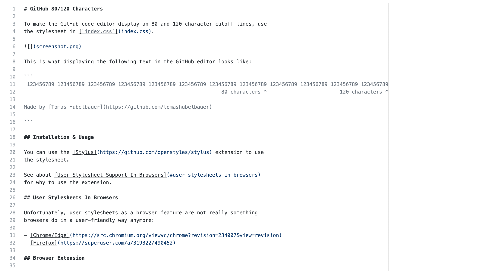

# GitHub 80 Characters

To make the GitHub code editor display an 80 and 120 character cutoff areas, use
this stylesheet:

```css
.CodeMirror-lines {
  /* Adjust by half a character to account for GitHub spacing */
  --80: 80.5ch;
  --120: 120.5ch;
  --color: silver;

  background: linear-gradient(
    to right,

    transparent,

    /* Render a line at 80 characters */
    transparent var(--80),
    var(--color) calc(var(--80) + 1px),
    transparent 0,

    /* Render a line at 120 characters */
    transparent var(--120),
    var(--color) calc(var(--120) + 1px),
    transparent 0,
    
    transparent
  )

  /* Override GitHub's own stylesheet */
  !important;
}
```

Here's how it looks displaying this text:

```
 123456789 123456789 123456789 123456789 123456789 123456789 123456789 123456789 123456789 123456789 123456789 123456789
                                                                 80 characters ^                        120 characters ^

Made by [Tomas Hubelbauer](https://github.com/tomashubelbauer)
```



You can use the [Stylus](https://github.com/openstyles/stylus) extension to use
a custom stylesheet on a page. Unfortunately, browsers nowadays no longer really
support user stylesheets:

- Chrome/Edge: https://src.chromium.org/viewvc/chrome?revision=234007&view=revision
- Firefox: https://superuser.com/a/319322/490452

## To-Do

### Figure out the extension manifest permissions for GitHub URLs

It seems I don't want a `content_script` but rather something like a background
script so that I have access to the extension APIs not the document context?

### Port the extension so it is compatible with Chrome as well

https://developer.chrome.com/docs/extensions/reference/tabs/#method-insertCSS
